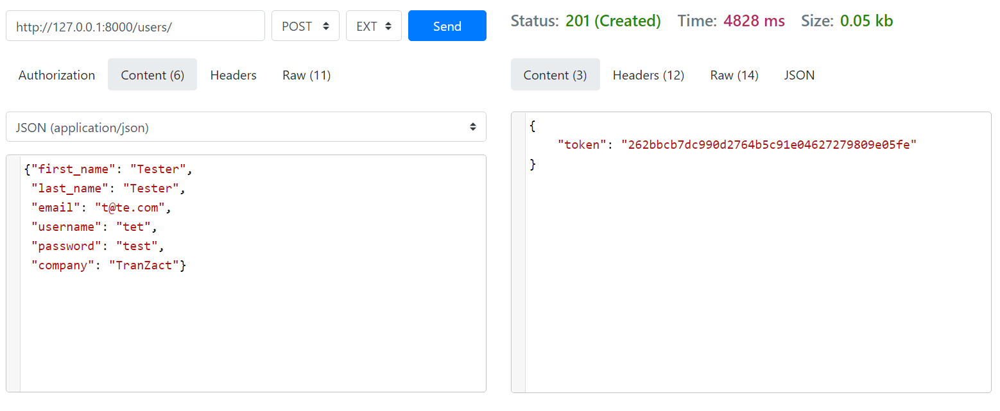
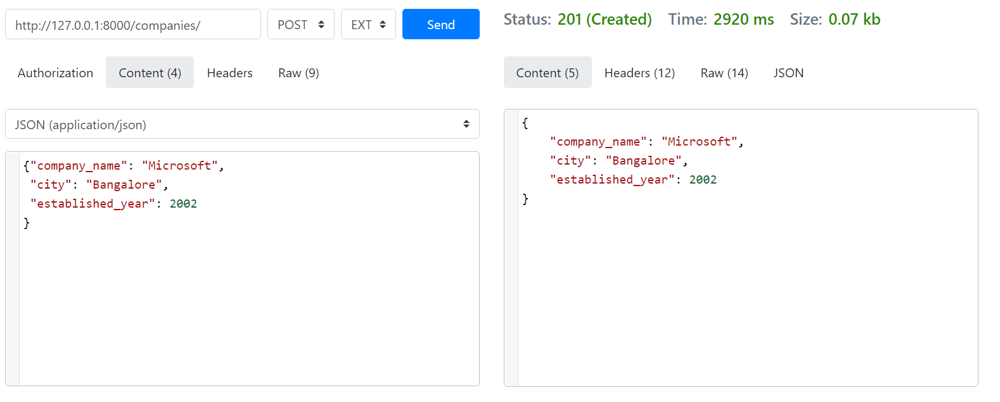
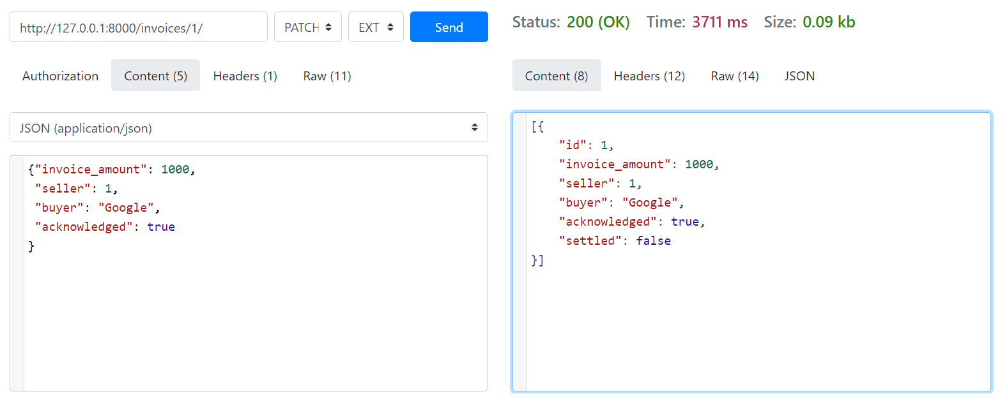
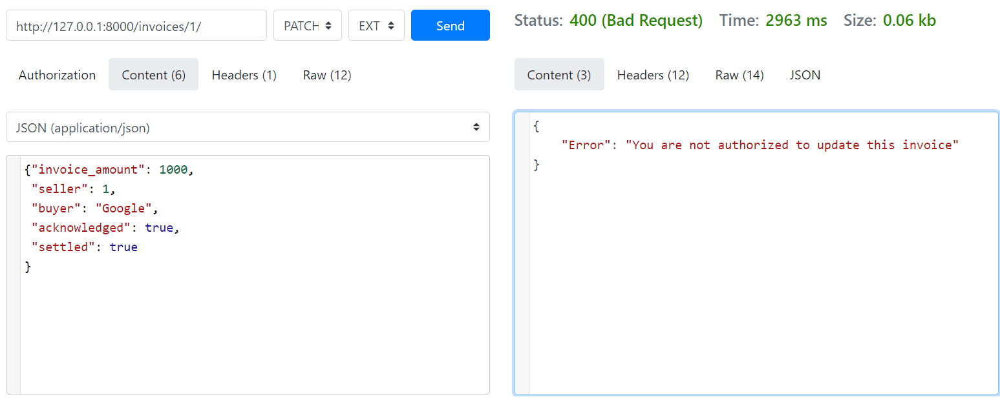

The app has 3 major endpoints:
# 1. /users/
This endpoint has 2 methods: GET and POST.

* GET returns the list of registered users.
* POST takes 6 arguments: first_name, last_name, email, username, password, company and then returns a token upon successful registration.
* company in POST request is the company name user wants to join.

* /users/int_id/ takes an integer id which is id of user and has two methods: GET and PATCH
* GET gives the details of that user.
* PATCH takes the arguments same as POST and changes the values accordingly.

# 2. /companies/
This endpoint also has 2 methods GET and POST.

* GET returns list of all the companies in the database.
* POST takes 3 arguments: company_name, city, established_year.
* company_name must be unique

* /companies/int_id/ takes an integer id which is id of company and has two methods: GET and PATCH
* GET gives the details of that company.
* PATCH takes the arguments same as POST and changes the values accordingly.

# 3. /invoices/
This endpoint also has 2 methods GET and POST.
* GET returns all the invoices if no user is detected.
* To get buying and selling invoices of specific company, a user token must be passed in headers which was assigned to the user while registering.
* If the token is valid, then two lists will be returned containing invoices for buying and selling.
* POST takes 5 arguments: invoice_amount, seller, buyer, settled, acknowledged.

* seller is a user, so id (integer) must be passed and buyer is a company, so company_name must be passed.
* If seller acknowledges or if seller's company and buyer are same, an error will be generated.
* /invoices/int_id/ has 2 methods GET and PATCH.
* GET lists all the details of that invoice.
* PATCH takes all the same arguments as POST along with necessary token from header.
* Only a user from buyer's company can change the acknowledged state user whose token was passed gets checked if his company is same as the buyer's company.
* Same goes for the seller, token gets checked for seller too.

